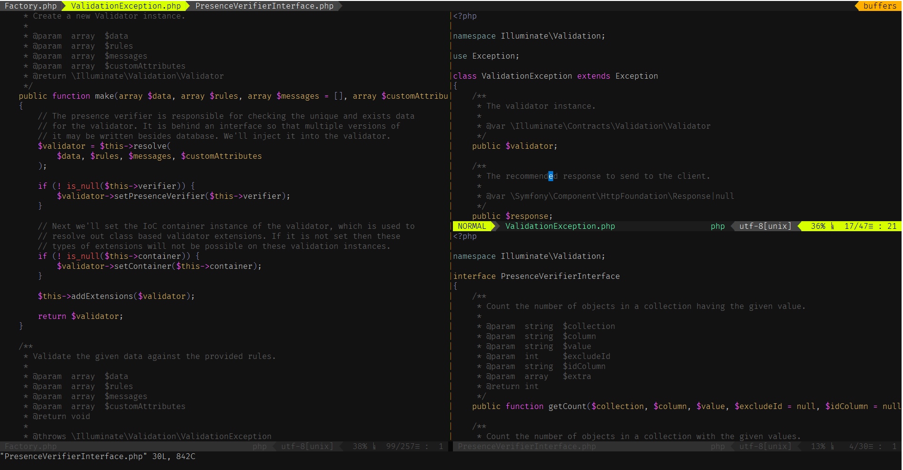
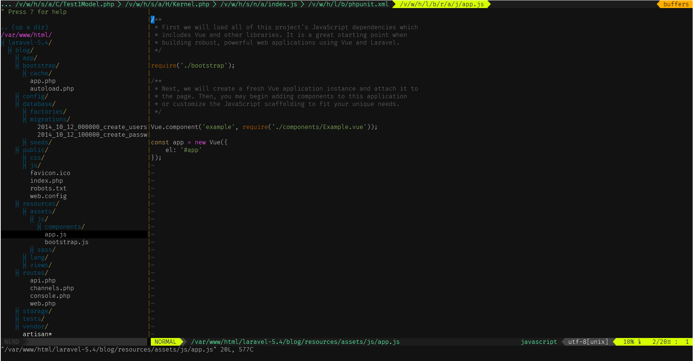
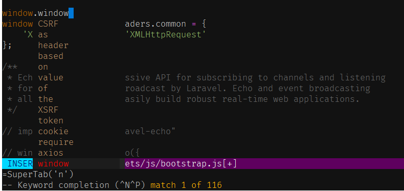

# vimrc
A working vimrc file for programmers. 

I've been a [Vim](http://www.vim.org/) user for more than a decade. It's a powerful editor available for most of the major operating systems. Simplicity and configurability are two of the prime reasons for its popularity.

Although feature-rich, a default out-of-the-box installation of Vim may not prove too useful for serious users. It's true power can be realized only when it is configured properly and the right plugins are installed (there are a lot).

This package includes a vimrc file along with some of the most popular plugins. It can be used to have vim configured for most purpose, especially after a fresh installation. It makes it easy to add other plugins too. I'd recommend to go through the comments inside _.vimrc_ at least once to make the most of this package, and to start making your own customizations - your style of work may be different from mine, afterall.

A number of shortcuts, plugins etc. used in this are inspired from Jeffery Way's [Laracasts](www.laracasts.com). The [video tutorials](https://laracasts.com/series/vim-mastery) describes beautifully the different plugins, themes, configurations etc. and power of Vim editor as a whole.

## How to Install

### Linux
####Ensure __vim__ is installed: `sudo apt-get install vim` or `sudo yum install vim`

```bash
cd ~ && git clone https://github.com/senaranya/vimrc.git
sh ~/vimrc/install.sh
alias vi=vim
```
Now open vi and run `:PluginInstall`

### Windows
TBD

## Plugins
This package uses [Vundle](https://github.com/VundleVim/Vundle.vim) to manage plugins. The file _.plugins.vim_ contains a list of plugins. To add a new plugin, add its Github name to this list and execute `:PluginInstall` inside vim.  

## Screenshots
####Split Screen


####File Explorer (plugin used: [Nerd Tree](https://github.com/scrooloose/nerdtree))


####Tab completion (plugin used: [SuperTab](https://github.com/ervandew/supertab))

